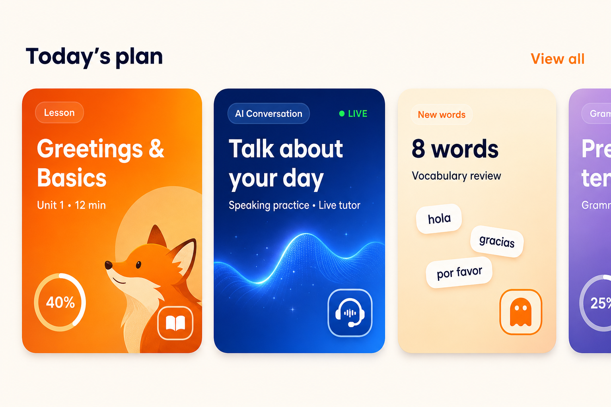
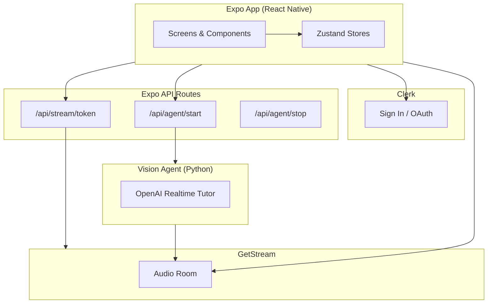

<p align="center">
  
</p>

<h1 align="center">Foxi</h1>

<p align="center">
  A Duolingo-inspired AI language learning app built with Expo and React Native.<br />
  Learn Spanish, French, and Japanese through interactive lessons with a live AI teacher.
</p>

<p align="center">
  
  
  
  
</p>

---

## Overview

**Foxi** is a mobile-first language learning experience that combines polished UI, structured lesson paths, and real-time AI tutoring. Users sign in, pick a language, follow a unit-based curriculum, and practice through vocabulary, listening, speaking, and live conversation activities — including audio sessions powered by Stream Video and an OpenAI Realtime vision agent.

Built as a production-style Expo app with file-based routing, persistent local progress, and secure server-side API routes for third-party credentials.

<p align="center">
  
</p>

> **Tip for your portfolio:** Replace the mockup above with 2–3 real device screenshots in a `docs/screenshots/` folder for the strongest GitHub presentation.

---

## Features

### Implemented

| Area | Details |
| --- | --- |
| **Onboarding** | Swipeable intro flow with mascot branding and sign-in entry points |
| **Authentication** | Email/password and Google OAuth via Clerk, with protected routes |
| **Language selection** | Spanish, French, and Japanese with persisted preference |
| **Home dashboard** | Greeting, streak & daily goal stats, continue learning, today's focus, recent vocabulary |
| **Learn path** | Unit-based lesson timeline with lock/unlock progression |
| **Interactive lessons** | Vocabulary, listening, speaking, and conversation activities |
| **AI audio teacher** | Live Stream audio calls with OpenAI Realtime agent (Foxi teacher) |
| **Progress tracking** | XP, lesson completion, exchange progress, and streaks via Zustand + AsyncStorage |
| **Profile** | User stats, level card, and account management |
| **Secure API routes** | Expo Router server routes for Stream tokens and vision agent sessions |

### In progress

- **Practice** tab — quick review sessions
- **Progress** tab — dedicated stats and streak history
- **Video-based AI lessons** — camera-ready via Stream WebRTC setup

---

## Tech Stack

| Layer | Technologies |
| --- | --- |
| **Mobile** | Expo 54, React Native, Expo Router, React 19 |
| **Styling** | NativeWind v5, Tailwind CSS v4, Poppins |
| **State** | Zustand, AsyncStorage |
| **Auth** | Clerk (`@clerk/expo`) |
| **Realtime / AI** | Stream Video SDK, Stream Vision Agents, OpenAI Realtime |
| **Backend** | Expo API routes (token minting, agent proxy) |
| **AI server** | Python Vision Agent service (`vision-agent/`) |

---

## Architecture



Secrets (`CLERK_SECRET_KEY`, `STREAM_API_SECRET`, `OPENAI_API_KEY`) stay on the server. The mobile client only receives short-lived tokens and public keys.

---

## Project Structure

```txt
foxi/
├── app/                    # Expo Router screens & API routes
│   ├── (auth)/             # Sign in, sign up, password reset
│   ├── (tabs)/             # Home, Learn, Practice, Progress, Profile
│   ├── lesson/[id].tsx     # Lesson detail & AI session
│   └── api/                # Stream token & vision agent proxy
├── components/             # Reusable UI (home, learn, lesson, auth, …)
├── constants/              # Spacing, images, navigation config
├── data/                   # Languages, units, lessons, onboarding content
├── hooks/                  # Stream audio, vision agent, auth helpers
├── lib/                    # API clients, Clerk/Stream server helpers
├── store/                  # Zustand stores with AsyncStorage persistence
├── types/                  # Shared TypeScript types
├── assets/                 # Mascot illustrations, icons, mockups
└── vision-agent/           # Python AI teacher service
```

---

## Getting Started

### Prerequisites

- Node.js 18+
- npm
- [Expo CLI](https://docs.expo.dev/get-started/installation/) (via `npx expo`)
- iOS Simulator (macOS) or Android emulator
- Accounts for [Clerk](https://clerk.com), [Stream](https://getstream.io), and [OpenAI](https://platform.openai.com) (for live AI lessons)

### 1. Install dependencies

```bash
npm install
```

### 2. Configure environment variables

Create a `.env` file in the project root:

```bash
# Clerk (client)
EXPO_PUBLIC_CLERK_PUBLISHABLE_KEY=pk_test_...

# Clerk (server — API routes only)
CLERK_SECRET_KEY=sk_test_...

# Stream (server only)
STREAM_API_KEY=...
STREAM_API_SECRET=...

# OpenAI (vision-agent service)
OPENAI_API_KEY=sk-...

# Optional: point the app at a deployed API (defaults to local Expo server)
# EXPO_PUBLIC_API_URL=https://your-host.example.com

# Optional: vision agent HTTP server (local dev)
VISION_AGENT_URL=http://127.0.0.1:8000
```

> Never commit `.env` files or expose secret keys in the mobile client.

### 3. Start the app

```bash
npx expo start
```

Then press `i` for iOS Simulator, `a` for Android emulator, or scan the QR code with a [development build](https://docs.expo.dev/develop/development-builds/introduction/).

> **Note:** Stream Video and WebRTC require a development build — Expo Go has limited support for these native modules.

### 4. (Optional) Run the AI teacher service

For live audio lessons with the Foxi AI tutor:

```bash
cd vision-agent
uv sync
uv run python -m foxi_teacher.main serve --host 0.0.0.0 --port 8000
```

See [`vision-agent/README.md`](vision-agent/README.md) for full agent setup and API details.

---

## Content

| | Count |
| --- | --- |
| Languages | 3 (Spanish, French, Japanese) |
| Units | 6 (2 per language) |
| Lessons | 18 |
| Activity types | Vocabulary, listening, speaking, conversation, review |

Lesson content lives in typed TypeScript files under `data/` — no database required.

---

## Scripts

| Command | Description |
| --- | --- |
| `npm start` | Start the Expo dev server |
| `npm run ios` | Run on iOS |
| `npm run android` | Run on Android |
| `npm run web` | Start web preview |
| `npm run lint` | Run ESLint |

---

## Highlights for Recruiters

- **End-to-end mobile product** — auth, navigation, content, state, and realtime AI in one codebase
- **Secure by design** — third-party secrets handled in Expo API routes, not the client
- **Teachable architecture** — clear separation of screens, components, data, stores, and lib helpers
- **Production patterns** — typed routes, persisted state, custom tab bar, pixel-refined UI spacing system
- **Modern stack** — Expo SDK 54, React 19, NativeWind v5, New Architecture enabled

---

## License

This project is private and intended for portfolio demonstration. All rights reserved.
